<div align="center">

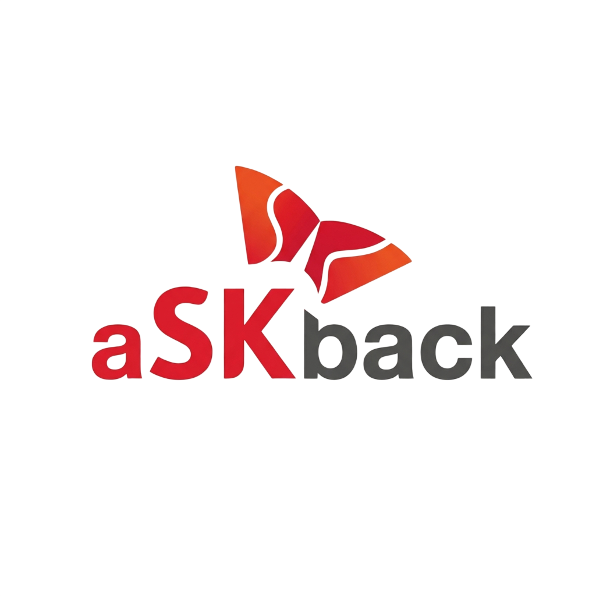

### aSKback RAG기반 맞춤 Q&A 서비스

**본 시스템은 교육 커리큘럼을 기반으로 학습자의 질의와 그에 대한 응답을 데이터베이스에 축적함으로써 교육 특화 지식 베이스를 구축한다.**

**이를 통해 교수자의 반복적 응답 부담을 줄이는 동시에, 학습 난이도가 높은 구간과 학습자별 취약 영역을 시각적으로 확인할 수 있는 대시보드를 제공한다.**

`Vue 3` · `Spring Boot 4` · `PostgreSQL 16` · `Docker Compose`

</div>


## 1. 설계 목적

| 사용자 | pain point | aSKback 이후 |
|---|---|---|
| **학생** | 수업 중 막혀도 빠른진도와 실시간 답변이 어려움 | 질문 등록 즉시 AI가 강의자료와 교수님 답변을 토대로 설명해줌 |
| **교수** | 매 기수 같은 질문에 다시 답변 | 바로 답변을 하지 못해도 AI 답변으로 학생들의 질문 해결가능 |
| **다음 기수** | 어떤 질문들이 있었는지 모음 | 쌓인 질문과 답변을 토대로 더 나은 답변을 얻을 수 있음 |

---

## 2. 질문 등록 플로우

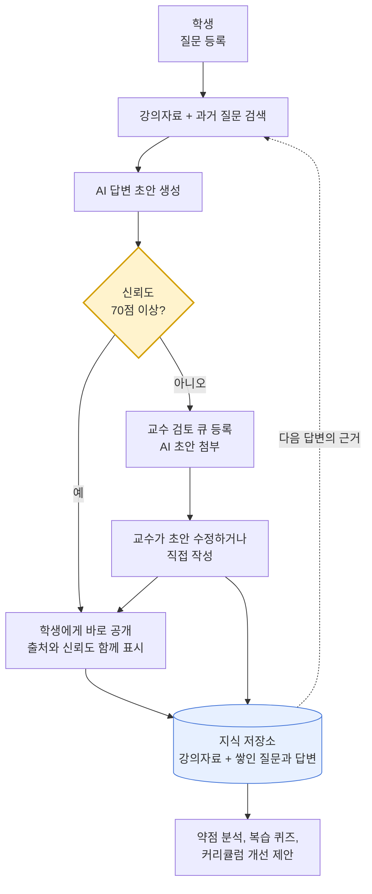


```
질문 → AI 답변 → 신뢰도 판단 → (낮으면) 교수 개입 → 지식 축적 → 다음 답변의 근거
```

---

## 3. 학생 화면

### 3-1. 교육일정에서 바로 질문하기

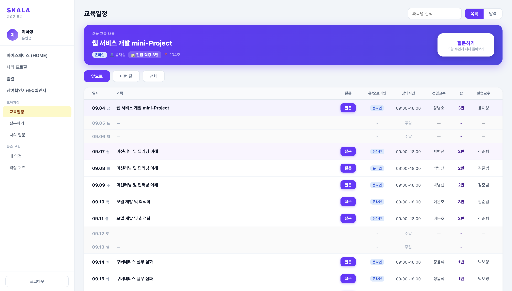


### 3-2. 질문 작성

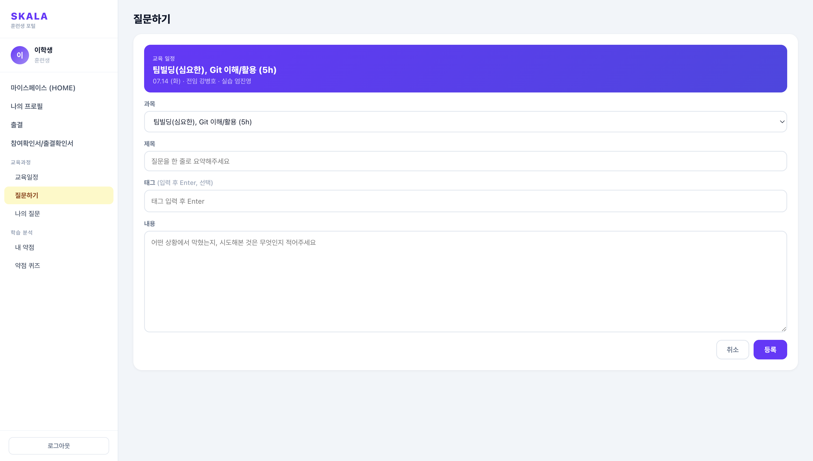


### 3-3. 나의 질문

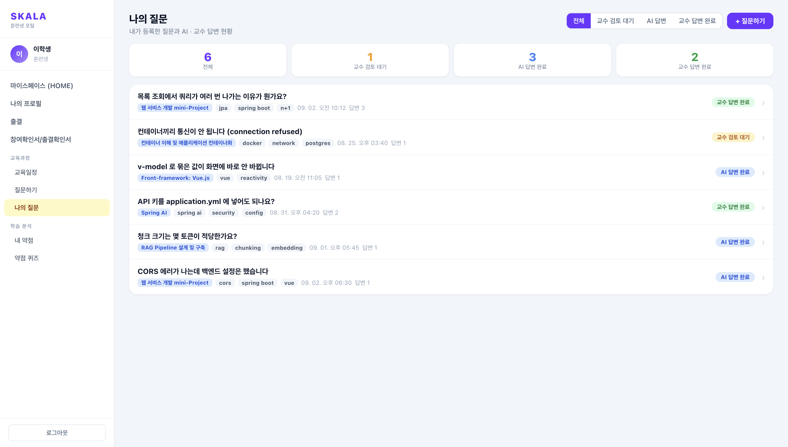


**질문 상태**

| 상태 | 뜻 | 다음에 일어나는 일 |
|---|---|---|
| `AI 답변 생성 중` | 질문은 등록됐고 답변을 만드는 중 | 잠시 뒤 AI 답변 생성 |
| `AI 답변 완료` | 신뢰도 70 이상이라 바로 확인가능 | 학생이 확인 |
| `교수 검토 대기` | 신뢰도 70 미만이라 보류됨 | 교수 큐로 넘김 |
| `교수 답변 완료` | 교수님이 답변을 달아줌 | 지식 디비에 쌓임 |

**답변 내용 상세보기**

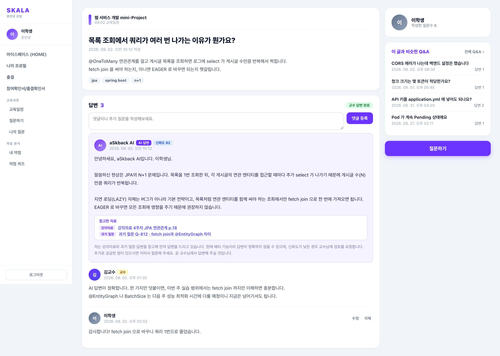

### 3-4. 약점 퀴즈 — 개념 고르기

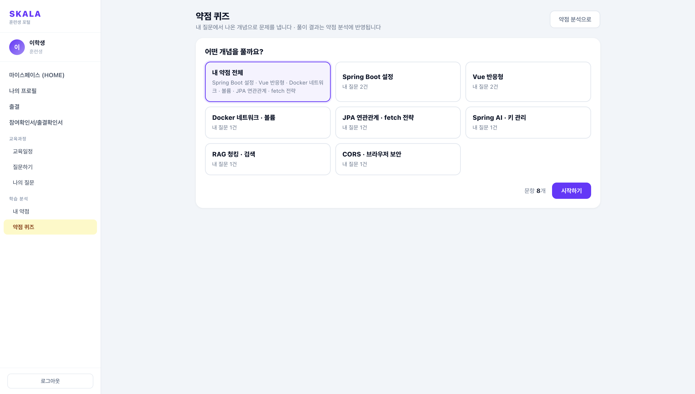


| **내가 물어본 질문 토대** | 내 질문을 기반으로 출제 |


### 3-5. 문제 풀이

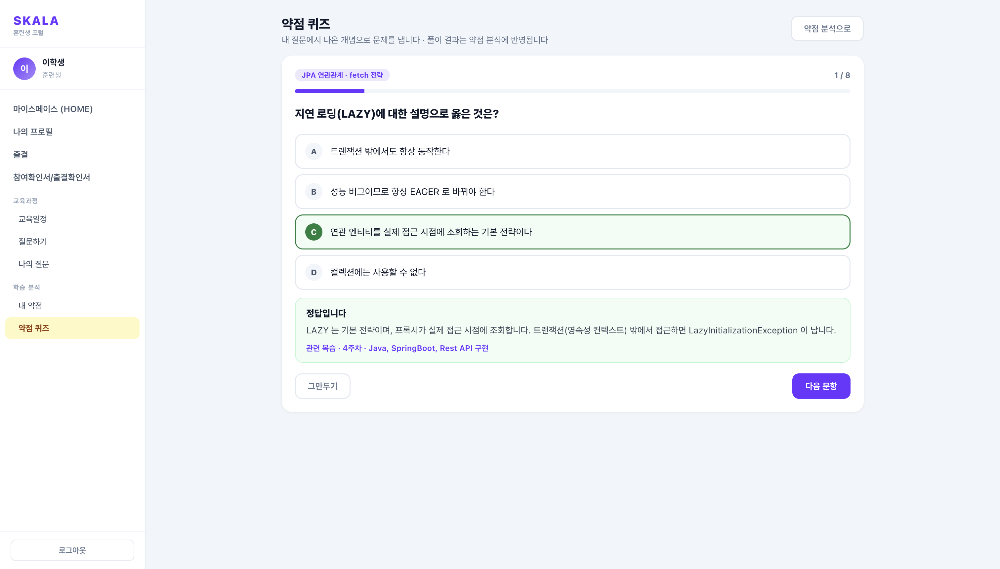


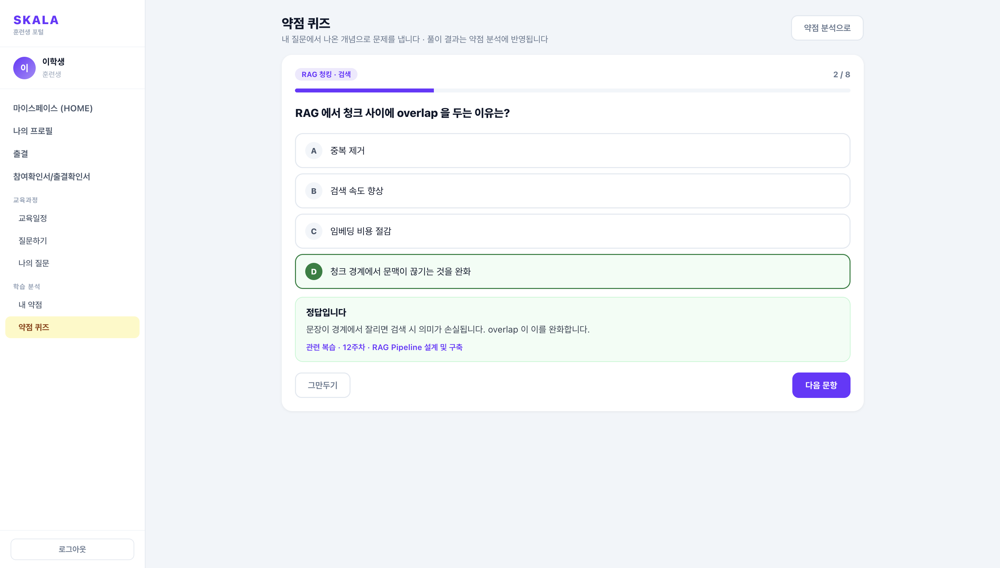

### 3-6. 약점 분석 결과

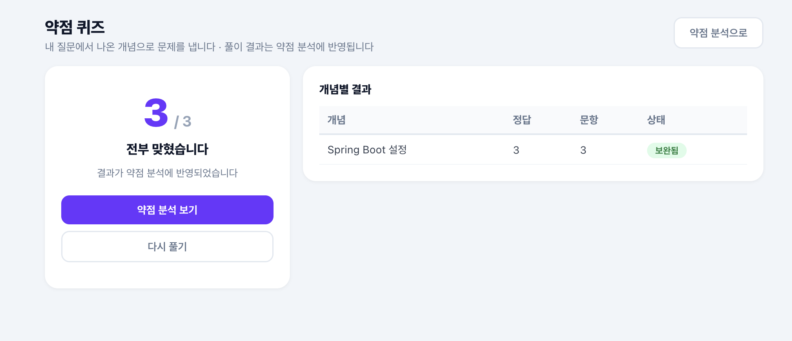

개념마다 정답 수와 상태가 결과 표에 남고 상태 라벨은 `취약`(50% 미만), `개선 중`(50~79%), `보완됨`(80% 이상), `미응시` 중 하나다. 이 퀴즈 결과가 `내 약점` 페이지의 순위를 다시 계산한다.

**약점 점수 계산식**

```
약점 점수 = (그 개념으로 한 질문 수 × 2)
          + (신뢰도 70 미만이었던 AI 답변 수)
          + (퀴즈 오답률 환산값)
```

---

## 4. 교수 화면

### 4-1. 질문 관리 — 검토 큐

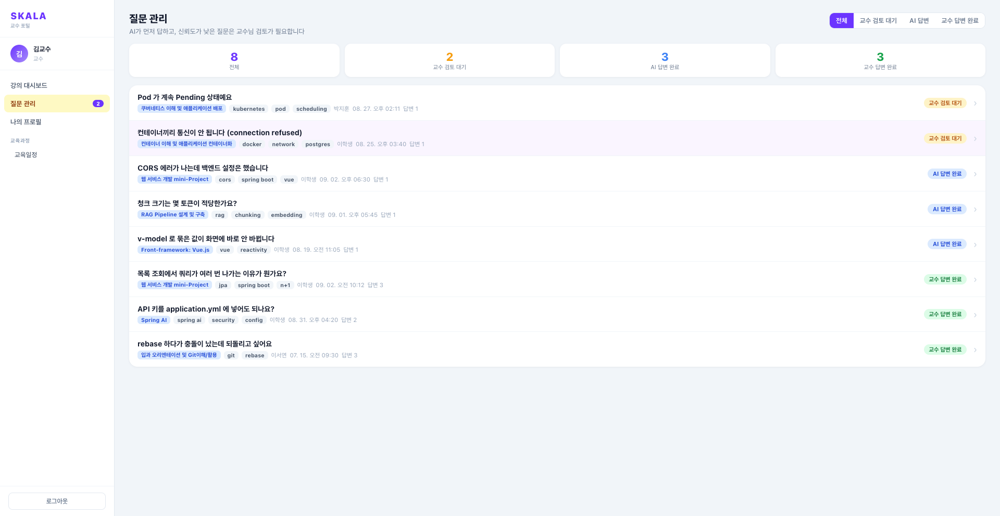

| 키워드 | 설명 |
|---|---|
| **AI 우선 원칙** | 부제 그대로 "AI가 먼저 답하고, 신뢰도가 낮은 질문은 교수님 검토가 필요합니다" |
| **검토 대기 강조** | 교수 손이 필요한 질문만 배경색으로 떠 있다 |
| **사이드바 배지** | 미처리 건수가 메뉴 옆 숫자로 항상 따라다닌다 |
| **상태 필터** | 전체 / 교수 검토 대기 / AI 답변 / 교수 답변 완료 |
| **AI 초안 첨부** | 상세로 들어가면 AI가 쓴 초안이 이미 있다. 처음부터 쓰지 않고 고쳐서 확정한다 |

### 4-2. 강의 대시보드

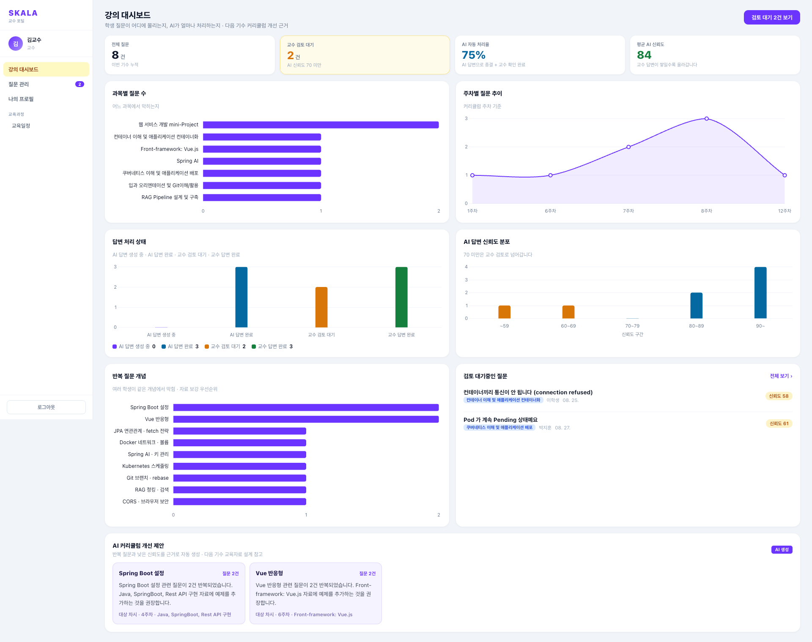


---

## 5. 시스템 설계

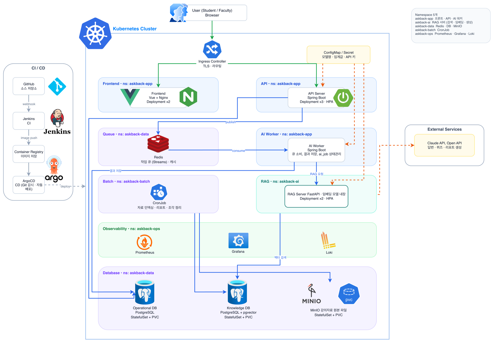


---


### 데모 계정

| 역할 | 아이디 | 비밀번호 |
|---|---|---|
| 학생 | `G000` | `G000` |
| 교수 | `G001` | `G001` |


---

## 6. 폴더 구조

```
skala-askback/
├── docker-compose.yml       아키텍처 전체를 컨테이너 13개로 정의, 쿠버네티스 개념 대응표 주석
├── db/
│   └── 01_init.sql          스키마와 목데이터, 최초 기동 시 자동 실행
├── backend/                 Spring Boot 4, Java 21
│   ├── Dockerfile
│   ├── build.gradle
│   └── src/main/java/com/skala/askback/
│       ├── controller/      REST 진입점
│       ├── service/         비즈니스 로직
│       ├── repository/      JPA
│       ├── entity/          테이블 매핑
│       └── dto/             응답 형식
├── frontend/                Vue 3, Vite
│   ├── Dockerfile
│   ├── nginx.conf           정적 서빙과 /api 프록시
│   └── src/
│       ├── router.js        경로별 접근 권한(학생 전용, 교수 전용)
│       ├── layouts/         사이드바 포함 공통 레이아웃
│       ├── pages/           화면 14개
│       ├── components/      차트 등 공용 조각
│       └── data/
│           ├── store.js      질문 상태 관리, AI 답변 생성 자리
│           ├── analytics.js  약점 점수와 대시보드 집계
│           ├── quizBank.js   개념 정의와 문항
│           └── schedule.json 교육일정
└── docs/images/             README 화면 이미지
```

---


<div align="center">

**SK AX Full-Stack Engineering · AI 웹 서비스 설계 미니프로젝트**

</div>
